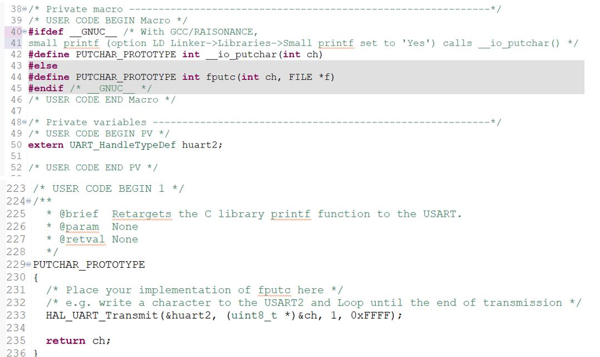

# 2425_ESE_BusReseau_Chapart_Fricot

# TP Bus et Réseaux Industriels

## Table des matières

1. [TP 1 - Bus I²C](#tp-1---bus-i2c)
   - [Capteur BMP280](#capteur-bmp280)
   - [Setup du STM32](#setup-du-stm32)
   - [Communication I²C](#communication-i2c)
2. [TP2 - Interfaçage STM32 - Raspberry](#tp2---interfaçage-stm32---raspberry)
   - [Mise en route du Raspberry Pi Zéro](#mise-en-route-du-raspberry-pi-zéro)
   - [Port Série](#port-série)
3. [TP3 - Interface REST](#tp3---interface-rest)
4. [Installation du Serveur Python](#installation-du-serveur-python)
   - [Première Page REST](#première-page-rest)

## TP 1 - Bus I²C
### 1.1 Capteur BMP280

Le BMP280 est un capteur de pression et température développé par Bosch (page produit). 
À partir de la datasheet du BMP280, nous avons identifié les éléments suivants : 

1. Les adresses I²C possibles pour ce composant : 
The 7-bit device address is 111011x.  
The 6 MSB bits are fixed.  
Le dernier bit est modifiable par la valeur SDO et peut être modifié en cours de fonctionnement. La connexion de SDO à GND donne l'adresse d'esclave 1110110 (0x76) ; la connexion à VDDIO donne l'adresse d'esclave 1110111 (0x77), ce qui est la même chose. 

2. Le registre et la valeur permettant d'identifier ce composant : 0xD0 “id” 

3. Le BMP280 offre trois modes d'alimentation : le mode veille, le mode forcé et le mode normal. Ces modes peuvent être sélectionnés à l'aide des bits mode [1:0] du registre de contrôle 0xF4. 
  - 00 --> mode veille
  - 01 and 10 --> mode forcé
  - 11 --> mode normal 

4. Les registres contenant l'étalonnage du composant : calib25...calib00 aux adresses 0xA1…0x88 

5. Les registres contenant la température (ainsi que le format) : 0xFA…0xFC “temp” (_msb, _lsb, _xlsb) 

6. Les registres contenant la pression (ainsi que le format) : 0xF7…0xF9 “press” (_msb, _lsb, _xlsb) 

7. Les fonctions permettant le calcul de la température et de la pression compensées, en format entier 32 bits : 

Les valeurs de pression et de température sont censées être reçues au format 20 bits, positif, stocké dans un entier signé de 32 bits. 

Pour compenser la pression on utilise la fonction bmp280_compensate_P_int64 et pour la température bmp280_compensate_T_int32. Ces fonctions sont fournis dans la doc du capteur.
Il faut remplacer les variables pour aller avec le reste de notre code.

### 1.2. Setup du STM32 

Sous STM32CubeIDE, nous avons mis en place une configuration adaptée à notre carte nucleo-F446RE. Pour ce TP, nous aurons besoin des connections suivantes : 

  - Une liaison I²C. (broches PA8 et PB4)
  - Une UART sur USB (UART2 sur les broches PA2 et PA3)
  - Une liaison UART indépendante pour la communication avec le Raspberry (TP2) (USART3 : PC10 et PC11)
  - D'une liaison CAN (TP4)

    
    
<strong>Figure 1 – Pinout view dans le fichier ioc</strong>

Afin de pouvoir plus facilement débuguer notre programme STM32, nous avons fait en sorte que la fonction printf renvoie bien ses chaînes de caractères sur la liaison UART sur USB, en ajoutant le code suivant au fichier stm32f4xx_hal_msp.c :

    
    
<strong>Figure 2 - Fichier stm32f4xx_hal_msp.c </strong>

    
    
<strong>Figure 3 – Fichier main.c et résultat dans la console </strong>

### 1.3. Communication I²C

L'API HAL fournie par ST propose 2 primitives permettant d'interagir avec le bus I²C en mode Master :
   - HAL_StatusTypeDef HAL_I2C_Master_Transmit(I2C_HandleTypeDef *hi2c, uint16_t DevAddress, uint8_t *pData, uint16_t Size, uint32_t Timeout)
   - HAL_StatusTypeDef HAL_I2C_Master_Receive(I2C_HandleTypeDef *hi2c, uint16_t DevAddress, uint8_t *pData, uint16_t Size, uint32_t Timeout)
Avec : 
   - I2C_HandleTypeDef hi2c: structure stockant les informations du contrôleur I²C
   - uint16_t DevAddress: adresse I³C du périphérique Slave avec lequel on souhaite interagir.
   - uint8_t *pData: buffer de données
   - uint16_t Size : taille du buffer de données
   - uint32_t Timeout: peut prendre la valeur HAL_MAX_DELAY

HAL_I2C_Master_Transmit permet d'écrire sur le bus, alors que HAL_I2C_Master_Receive permet de lire le bus. Ces 2 fonctions gèrent le bit R/W, mais il faut quand même lui laisser la place dans l'adresse I²C. 

L'adresse I²C est officiellement sur 7 bits. L'API HAL du STM32 demande des adresses I²C sur 8bits, le LSB étant réservé au bit de R/W. Il faudra donc penser à décaler les adresses d'1 bit sur la gauche et laisser le LSB à 0.

    

#### Identification du BMP280
L'identification du BMP280 consiste en la lecture du registre ID
En I²C, la lecture se déroule de la manière suivante :
1.	Envoyer l'adresse du registre ID
2.	Recevoir 1 octet correspondant au contenu du registre

    
    
<strong>Figure 4 – Fichier main.c : identification et résultat dans la console </strong>

On reçoit 88 en décimal ce qui correspond bien à 0x58 en hexadécimal. C’est bien l’ID par défaut que doit avoir notre capteur BMP280.

#### Configuration du BMP280
Avant de pouvoir faire une mesure, il faut configurer le BMP280.
Pour commencer, nous allons utiliser la configuration suivante : mode normal, Pressure oversampling x16, Temperature oversampling x2
1.	On envoie l'adresse du registre à écrire, suivi de la valeur du registre :
   - Les bits 1 et 0 du registre correspondent au power mode qui est dans notre cas le mode normal (11)
   - Les bit 4,3 et 2 = oversampling of pressure data x16 (101)
   - Les bit 7,6 et 5 = oversampling of temperature data x2 (010)
La valeur a envoyé est donc 01010111 = 0x57.

    
    
<strong>Figure 5 – Fichier main.c : configuration du BMP280 et résultat dans la console </strong>

Nous recevons la nouvelle valeur du registre : 87, ce qui correspond à 1010111 en binaire, ce qui est bien la configuration attendue.

#### Récupération de l'étalonnage, de la température et de la pression
Récupérez en une fois le contenu des registres qui contiennent l'étalonnage du BMP280.
Dans la boucle infinie du STM32, récupérez les valeurs de la température et de la pression. Envoyez sur le port série le valeurs 32-bit non compensées de la pression de la température.

    
    
<strong>Figure 6 – Fichier main.c : récupération de l’étalonnage et résultat dans la console </strong>

## 2. TP2 - Interfaçage STM32 - Raspberry

Objectif : Permettre l'interrogation du STM32 via un Raspberry Pi Zero Wifi

### 2.1. Mise en route du Raspberry PI Zéro
#### Préparation du Raspberry
Configuration réseau du routeur utilisé en TP : 
SSID : D060 – 2GHz
Password : ilovelinux

#### Premier démarrage
Nous devons installer la carte SD dans le Raspberry et brancher l'alimentation. Nous avons ensuite utilisé ssh pour nous connecter à notre Raspberry. 
La Raspberry s'est connectée au réseau, puis elle a demandé une adresse IP au routeur. Ce dernier lui a attribué une IP disponible parmi les 256 possibilités, en tenant compte de celles déjà utilisées. Le nombre 256 provient du masque de sous-réseau.

On identifie le network range avec “ip a” :

    
    
<strong>Figure 7 – Identification du network range dans le terminal </strong>

1 : adresse de loopback
2 : réseau wifi
3 : docker

On identifie 192.168.88.228/24.

On scan ensuite le réseau avec nmap :

    
    
<strong>Figure 8 – Visualisation du réseau à l’aide de la commande nmap </strong>

Grâce à ce nmap, nous pouvons identifier les raspberry disponibles sur le réseau, pour pouvoir par la suite nous connecter à notre Raspberry.

    
    
<strong>Figure 9 – Connection à la Raspberry </strong>

### 2.2. Port Série
#### Loopback
On branche le port série du Raspberry en boucle : RX sur TX. On utilise ensuite le logiciel minicom sur la Raspberry pour tester le port série.

    

Lorsque l’on écrit quelques lettres au clavier, elles s’affichent bien, cela montre que le loopback fonctionne.
#### Communication avec la stm32

| Requête du RPi | Réponse du STM   | Commentaire                                   |
|----------------|-------------------|----------------------------------------------|
| GET_T          | T=+12.50_C       | Température compensée sur 10 caractères      |
| GET_P          | P=102300Pa       | Pression compensée sur 10 caractères         |

Pour la communication avec la stm32, nous avons 

    

## 3. TP3 - Interface REST

    
    
<strong>Figure 10 - Transfert de fichier de l’ordi vers la Raspberry  </strong>

### 3.1. Installation du serveur Python

Dans un premier temps, nous devons créer notre propre utilisateur, avec les droits de sudo et d'accès au port série (dialout) :
   - sudo adduser luluchacha: création d’un nouvel utilisateur avec le nom luluchacha. Le préfixe sudo signifie que la commande est exécutée avec des privilèges administratifs.
   - sudo usermod -aG sudo luluchacha: ajout de l'utilisateur au groupe sudo. Cela lui permet d'exécuter des commandes avec des privilèges administratifs en utilisant sudo.
   - sudo usermod -aG dialout luluchacha: ajout de l'utilisateur au groupe dialout, ce qui lui permet d'accéder aux périphériques de communication série.
Nous nous délogguons, puis nous nous relogguons en tant que luluchacha.

Installation pip pour python3 sur le Raspberry :
sudo apt update
sudo apt install python3-pip

Création d’un répertoire pour le développement de notre serveur. Dans ce répertoire, nous devons créer un fichier nommé requirement.txt dans lequel nous plaçons le texte suivant :
pyserial
flask

Installation des bibliothèques par la commande : pip3 install -r requirement.txt

À nouveau, nous nous délogguons, puis nous nous relogguons en tant que luluchacha pour mettre à jour le PATH et permettre de lancer flask.
On lance notre serveur sur l’adresse de loopback. Cela permet d’accéder au serveur depuis la raspberry pi en local mais pas depuis le réseau.
Quand on effectue un simple curl, on peut voir la requête GET, qui est traitée par le serveur.

    

Headers lors de la connexion au serveur : 

    

On lance le serveur sur le port 5000 de la raspberry pi.

    

Nous pouvons désormais accéder au serveur depuis un navigateur sur un pc connecté au réseau. Pour cela, il faut entrer l'ip de la raspberry en spécifiant son port.

    

### 3.2. Première page REST
Quel est le rôle du décorateur @app.route?
Le décorateur @app.route permet d’associer un chemin à une certaine fonction telle que hello world dans l’exemple ci-dessous :

    

Cette fonction va correspondre à l'adresse http://192.168.88.228:5000/ depuis un navigateur.

Le fragment <int:index> dans le décorateur @app.route est utilisé pour définir une variable dynamique dans l'URL :

    

    

## 4. TP4 - Bus CAN

**Objectif**: Développement d'une API Rest et mise en place d'un périphérique sur bus CAN

Nous avons utilisé le bus CAN pour piloter un module moteur pas-à-pas.
La carte moteur est un peu capricieuse et ne semble tolérer qu'une vitesse CAN de 500kbit/s. Nous avons donc réglé CubeMx en conséquence, à l'aide d'un calculateur: 

    

    

### 4.1. Pilotage du moteur

Pour faire bouger le moteur de 90° dans un sens, puis de 90° dans l'autre, nous avons envoyé le message suivant :

    

